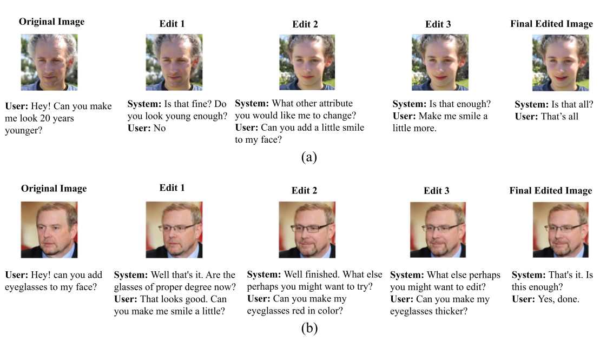
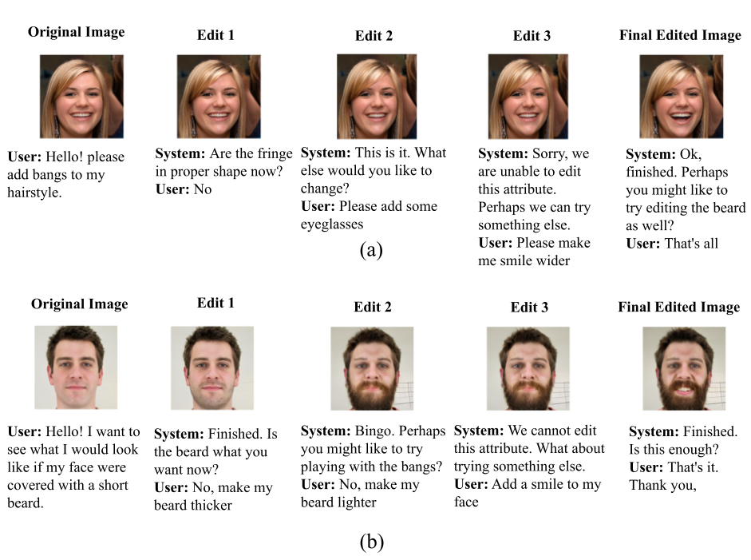
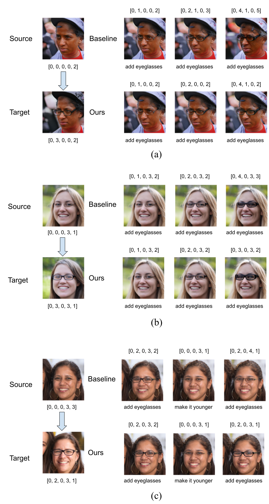
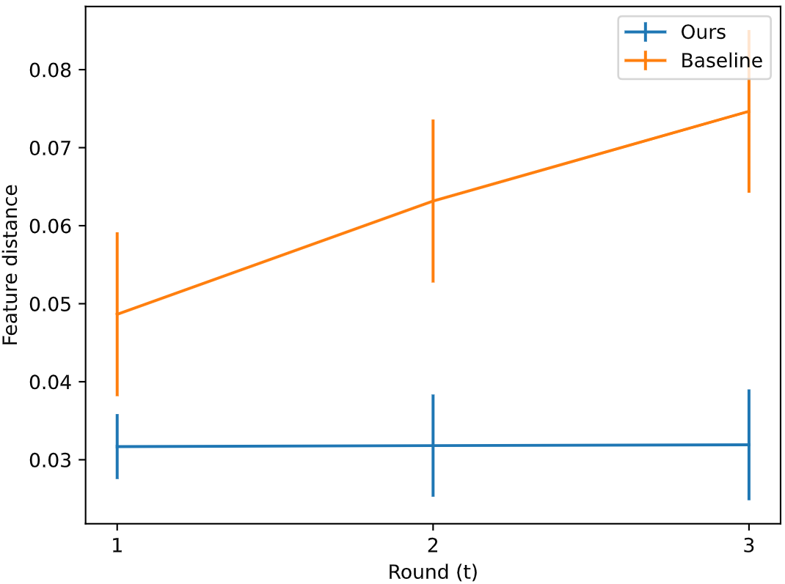
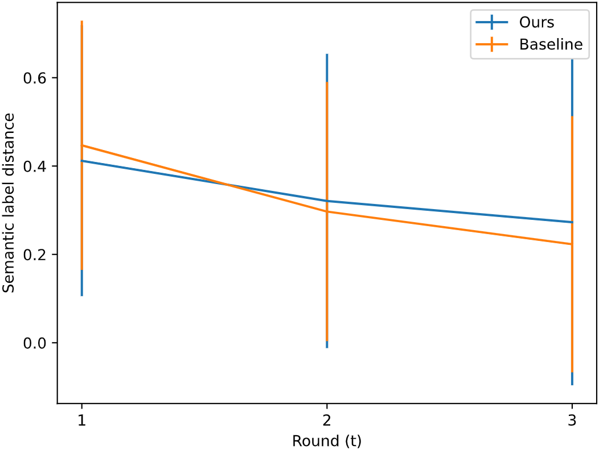

# Talk-to-Edit with RL extension

This repository is a reinforcement learning based extension of this paper:
> **Talk-to-Edit: Fine-Grained Facial Editing via Dialog** 
> Yuming Jiang∗, Ziqi Huang∗, Xingang Pan, Chen Change Loy, Ziwei Liu 
> IEEE International Conference on Computer Vision (**ICCV**), 2021 

## Our Code Structure
We aggregate our code base into two notebooks:
1. Editing with simulator (demo/qualitative results): 
2. RL based editing with simulator (training): 

The code written as scripts is structured:
* `utils/dialog_edit_utils.py`:
  * `EditTracker`: Gaussian Policy + State Tracker
    * `supervised_loss`: Supervised feature distance loss
    * `reinforce_loss`: REINFORCE loss
  * `gen_simulated_query`: User simulator
  * `dialog_with_simulator`: Interactive simulation environment (demo/test)
  * `train_with_simulator`: Interactive simulation environment (training)
* `policy_network.pth`: Our pretrained policy.

## Qualitative Results

### Running examples of interactive editing
edit images for multiple fields

edit images for multiple degree

### Comparison results of baseline and ours

## Quantitative Results
### Feature Preservation
We shows the quantitative results of the feature distances of multi-round
interactive image editing. For the baseline method, We observe a trend of increasing feature distance
between its edited image and the target image. This observation may imply that while the baseline
method is editing the semantic attribute of the facial image, some other characteristics (e.g. facial
identity, background, colors, etc.) of the source image are not well preserved. In practice, such
deviation from the source image can be magnified in longer user sessions since the bias is accumulated
through multiple rounds.

### Semantic Attribute Preservation

## CelebA-Dialog Dataset

[**CelebA-Dialog Dataset**](https://mmlab.ie.cuhk.edu.hk/projects/CelebA/CelebA_Dialog.html) is available for [Download](https://drive.google.com/drive/folders/18nejI_hrwNzWyoF6SW8bL27EYnM4STAs?usp=sharing).

**CelebA-Dialog** is a large-scale visual-language face dataset with the following features:
- Facial images are annotated with rich **fine-grained labels**, which classify one attribute into multiple degrees according to its semantic meaning.
- Accompanied with each image, there are **captions** describing the attributes and a **user request** sample.

The dataset can be employed as the training and test sets for the following computer vision tasks: fine-grained facial attribute recognition, fine-grained facial manipulation, text-based facial generation and manipulation, face image captioning, and broader natural language based facial recognition and manipulation tasks.

The codebase is maintained by [Junda Wu](https://github.com/JoshuaWu1997).

Part of the code is borrowed from [Talk-to-Edit](https://github.com/yumingj/talk-to-edit).
[[Paper](https://arxiv.org/abs/2109.04425)]
[[Project Page](https://www.mmlab-ntu.com/project/talkedit/)]
[[CelebA-Dialog Dataset](https://mmlab.ie.cuhk.edu.hk/projects/CelebA/CelebA_Dialog.html)]